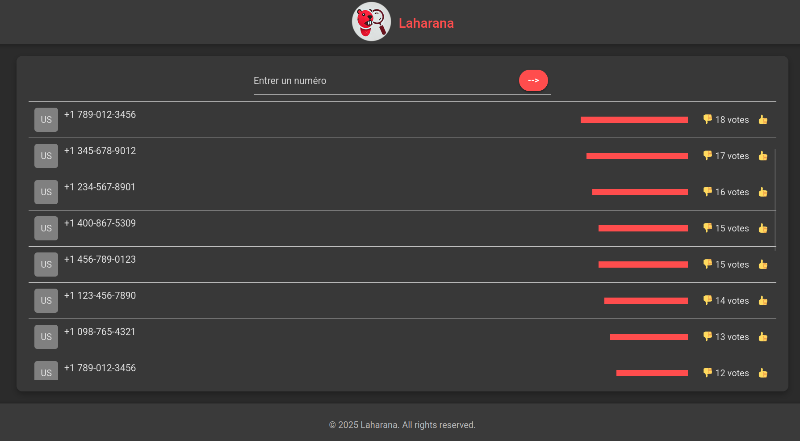
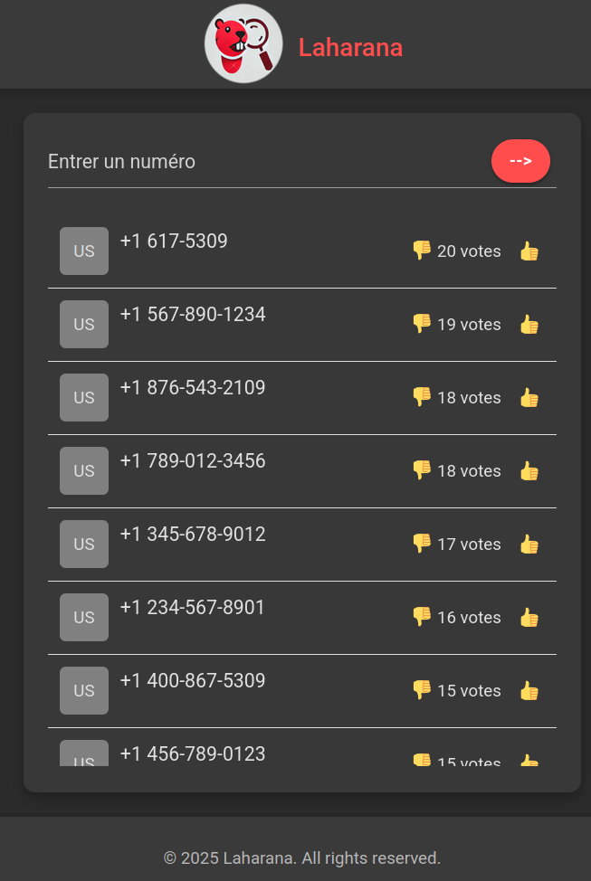

# Laharana: Pirate Number Tracker

Laharana is a community-driven application designed to track and manage **pirate or harmful phone numbers**. Users can contribute by adding suspicious numbers, voting, or downvoting existing entries to help identify and flag potentially dangerous or fraudulent phone numbers. This app empowers users to protect themselves and others by sharing information about harmful numbers in a collaborative and transparent way.

---

## Features

### 1. **Add Pirate Numbers**
   - Users can add new pirate or harmful phone numbers to the database.
   - Each entry includes:
     - Phone number
     - Location (optional)
     - Description (optional)

### 2. **Vote and Downvote**
   - Users can vote (`👍`) or downvote (`👎`) existing entries to indicate their validity.
   - The number of votes determines the credibility of each entry.

### 3. **View Pirate Numbers**
   - A list of all reported numbers is displayed, sorted by the number of votes.
   - Each entry shows:
     - Phone number
     - Location
     - Number of votes
     - A visual vote bar to indicate the level of community trust.

### 4. **Search and Filter**
   - Users can search for specific numbers or filter entries by location.

### 5. **Alert System**
   - A beautiful **AlertModal** is used to display messages (e.g., success, errors, or warnings) in a visually appealing way.

---

## How It Works

1. **Add a Number**:
   - Use the form to add a new pirate or harmful phone number.
   - Provide details such as the number, location, and description.

2. **Vote on Numbers**:
   - Browse the list of reported numbers.
   - Vote (`👍`) if you believe the number is harmful.
   - Downvote (`👎`) if you think the number is safe or incorrectly flagged.

3. **Track Pirate Numbers**:
   - The app dynamically updates the list based on user votes.
   - Numbers with higher votes are highlighted as more credible.

4. **Stay Informed**:
   - Use the search and filter features to find specific numbers or locations.

---

## Technologies Used

- **Frontend**:
  - HTML, CSS, JavaScript
  - Modern CSS for styling (e.g., flexbox, grid, animations)
  - ES6 Classes for modular and reusable components (e.g., `ListView`, `FormView`, `AlertModal`)

- **Backend** (optional for future implementation):
  - Node.js, Express.js
  - Database (e.g., MongoDB, PostgreSQL) to store and manage numbers and votes.

---

## Installation

### Prerequisites
- A modern web browser (e.g., Chrome, Firefox, Edge).

### Steps
1. Clone the repository:
   ```bash
   git clone https://github.com/rzafiamy/laharana.git
   ```
2. Navigate to the project directory:
   ```bash
   cd laharana
   ```
3. Open `index.html` in your browser:
   ```bash
   open index.html
   ```

---

## Usage

1. **Add a Number**:
   - Fill out the form with the phone number and optional details.
   - Click the submit button (`-->`) to add the number to the list.

2. **Vote on Numbers**:
   - Click the `👍` button to upvote or the `👎` button to downvote a number.

3. **Search and Filter**:
   - Use the search bar to find specific numbers or filter by location.

4. **View Alerts**:
   - If an error occurs (e.g., missing fields), a red-themed `AlertModal` will display the error message.

---

## Screenshots

### 1. Main Interface


### 2. Mobile


---

## Future Enhancements

1. **User Authentication**:
   - Allow users to create accounts and track their contributions.

2. **Backend Integration**:
   - Store data in a database for persistence and scalability.

3. **Mobile App**:
   - Develop a mobile version of Laharana for iOS and Android.

4. **Advanced Filters**:
   - Add filters for date, vote count, and location.

5. **Admin Dashboard**:
   - Provide admins with tools to manage and verify reported numbers.

---

## Contributing

We welcome contributions! If you'd like to contribute to Laharana, please follow these steps:

1. Fork the repository.
2. Create a new branch for your feature or bugfix:
   ```bash
   git checkout -b feature/your-feature-name
   ```
3. Commit your changes:
   ```bash
   git commit -m "Add your message here"
   ```
4. Push to the branch:
   ```bash
   git push origin feature/your-feature-name
   ```
5. Open a pull request.

---

## License

This project is licensed under the **MIT License**. See the [LICENSE](LICENSE) file for details.

---

## Contact

For questions, feedback, or support, please contact:

- **Email**: support@laharana.com
- **GitHub**: [Your GitHub Profile](https://github.com/rzafiamy)

---

## Acknowledgments

- Inspired by community-driven platforms like [Truecaller](https://www.truecaller.com/).
- Built with ❤️ by [Your Name].

---

Thank you for using Laharana! Together, we can make the world a safer place by tracking and reporting harmful phone numbers. 🚀